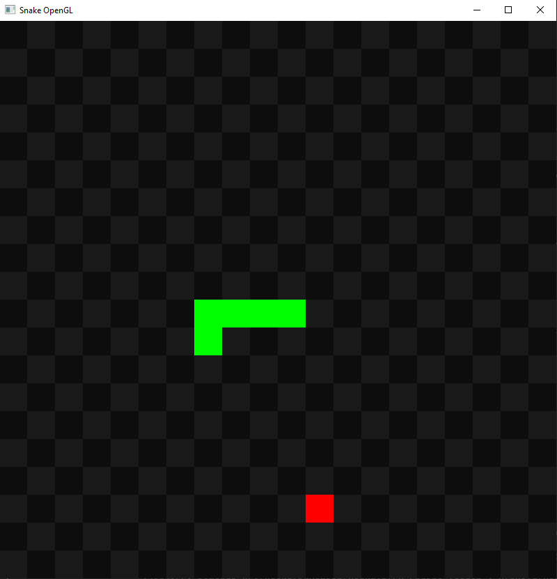

# Snake OpenGL

A simple implementation of the Snake game in C++ using OpenGL 3.3.

## Controls
- Arrow keys: Move
- P: Pause / Resume
- R: Restart game
- ESC: Exit

## Requirements
- Libraries: GLEW, GLFW3
- C++ compiler supporting C++11

## Compilation (Linux Example)
g++ main.cpp -o snake -lGLEW -lglfw -lGL
